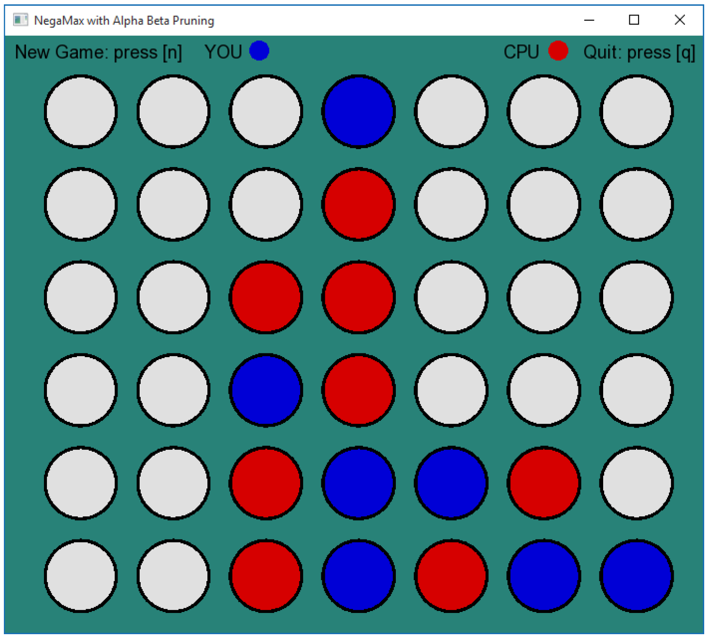
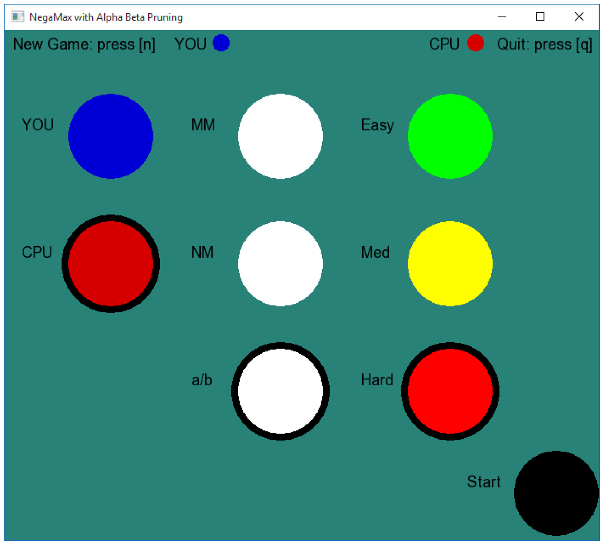

# connect-four
Connect-four with MiniMax algorithm and SFML 2.3.2 (https://www.sfml-dev.org)

https://youtu.be/YjcK1rsN9r0

Three different versions are implemented:

1. Classic MiniMax
2. NegaMax
3. NegaMax with Alpha Beta Pruning

Difficulty level is set with the depth of computation:

1. Easy = 1
2. Medium = 5
3. Hard = 9

Using difficulty level *Hard* it is necessary to use alpha beta pruning due to the processing time.

## Game UI

## Menu

